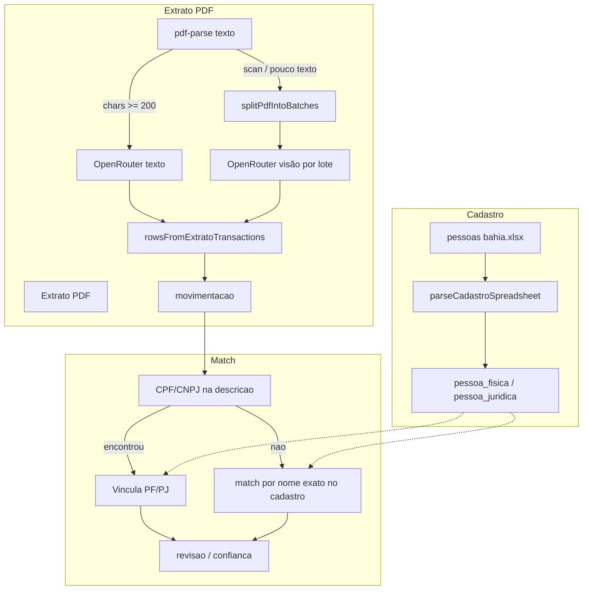

# Documentos de teste — descobertas, gaps e adaptações de ingestão

**Data:** 2026-05-26  
**Contexto:** Validação do fluxo real de prestação de contas usando a pasta `Documentos para teste /` como base operacional (Bahia / extratos janeiro).  
**Status:** Implementado no código (`@spc-up/core`); este documento registra o que foi observado, o que quebrava, o que foi corrigido e como operar.

---

## 1. Resumo executivo

A pasta de teste contém **dois tipos distintos de arquivo** que não devem ser confundidos na UI nem no pipeline:

| Arquivo | Papel no sistema | Parser correto |
|---------|------------------|----------------|
| `pessoas bahia (1).xlsx` | **Cadastro PF/PJ** (base para match) | `parseCadastroSpreadsheet` |
| `Extrato Jan PIX (1).pdf` | **Movimentações** (extrato bancário) | `ingestPdfExtrato` + OpenRouter |
| `EXTRATO TOTAL JANEIRO (1) (1).pdf` | Idem | Idem |

**Ordem operacional recomendada:** importar cadastro → ingerir extratos → revisar pendências → export SPCA.

**Principais descobertas:**

1. Planilha Bahia **não tem linha de cabeçalho** — o parser antigo tratava a primeira pessoa como título de coluna.
2. PDFs de extrato são **escaneados** (zero texto em `pdf-parse`) — obrigatório caminho **visão** via OpenRouter.
3. Modelo **Kimi** (`moonshotai/kimi-k2.6`) exige timeout maior, `json_object` em vez de `json_schema` strict, e **lotes por página** para não estourar tempo nem payload.
4. Extrato PIX retornou transações **só com nome** (sem CPF na resposta da IA) — regra B antiga descartava tudo; foi adicionado fallback por **nome** + match no cadastro.
5. **Cache** por hash de arquivo + modelo evita re-pagar tokens; trocar de modelo exige cache novo (chave inclui slug do modelo).

---

## 2. Inventário dos documentos de teste

### 2.1 `pessoas bahia (1).xlsx` (~17 KB, 258 linhas)

**Layout real (sem cabeçalho):**

```
Coluna A          | Coluna B           | Coluna C           | Coluna D
------------------|--------------------|--------------------|----------
nome              | CPF/CNPJ           | Pessoa Física/Jurídica | Validado
(ex.: iago...)    | 002.493.285-00     | Pessoa Física      | Validado
```

- **257 linhas de dados** na prática (258 linhas na planilha; 1 linha “perdida” quando se usava workaround manual).
- Coluna **Validado** é metadado operacional — **não** entra no schema de cadastro (`documento`, `nome`, `tipo` opcional).
- Tipos aceitos: `Pessoa Física`, `Pessoa Jurídica` (normalizados para PF/PJ).

**Resultado após correção (parser headerless):**

- **256 registros OK**, **1 erro** de validação (documento/tipo inválido em uma linha).
- Import com mapeamento sugerido: `nome` | `documento` | `tipo`.

**Erro comum:** enviar este arquivo para ingestão de **extrato** (`parseExcel`) → falha com `Colunas obrigatórias ausentes: data, descricao, valor`.

### 2.2 `Extrato Jan PIX (1).pdf` (~463 KB, 2 páginas)

- `pdf-parse`: **0 caracteres** de texto → `hasEnoughText: false`.
- Caminho: **OpenRouter visão** (`extractTransactionsFromPdfFile`).
- Teste real (Gemini, cache frio): ~34 transações em ~12 s.
- Teste real (Kimi, antes do timeout 180s): abort em 60s com PDF inteiro — motivou lotes por página.

**Amostra típica da IA (sem CPF no JSON):**

```json
{
  "data": "2025-01-01",
  "valor": 100,
  "direcao": "ENTRADA",
  "descricao": "GABRIEL REIS DA SILVA"
}
```

### 2.3 `EXTRATO TOTAL JANEIRO (1) (1).pdf` (~462 KB, 3 páginas)

- Mesmo perfil: scan, visão obrigatória.
- Antes: limite rígido de **3 páginas** gerava erro; com lotes, limite subiu para **`MAX_EXTRATO_PAGES=12`** (configurável).

---

## 3. Fluxo de processamento e match



### 3.1 Cadastro → banco

- API web: `POST /api/pessoas/import/preview` → sugere colunas.
- API web: `POST /api/pessoas/import` com `columnMap`.
- Flag `headerless: true` no preview quando a linha 1 parece dado (CPF/CNPJ detectado, sem aliases de cabeçalho).

### 3.2 Extrato → movimentações

Entrada principal: `ingestPdfExtrato` em `packages/core/src/ingest/pdf.ts`.

1. `extractPdfText` — só para decidir text vs visão (não substitui OCR em scan).
2. Se texto suficiente → `extractTransactionsFromPdfText`.
3. Senão → `extractTransactionsFromPdfFile` (com lotes; ver seção 5).
4. `rowsFromExtratoTransactions` — normaliza para `ParsedTransactionRow`.
5. `persistTransactions` + `applyAiMatchToMovimentacao` (regras + Kimi para ambíguos).

### 3.3 Regras de match (determinístico)

| Prioridade | Fonte | Evidência | Comportamento |
|------------|-------|-----------|---------------|
| 1 | CPF/CNPJ em `descricao_raw` | `CPF_CADASTRO` / `CPF_EXATO` | Vincula ou cria stub |
| 2 | Sem documento, nome único no cadastro | `NOME_CADASTRO` | Match exato em `pessoa_fisica.nome` ou `pessoa_juridica.razao_social` (score ~85% do CPF) |
| 3 | Múltiplos docs na mesma linha | `CONFLITO_DOCUMENTO` | Pendente revisão |

**Regra B (extrato):** linhas da IA **com** CPF/CNPJ válido ganham sufixo `CPF xxx` / `CNPJ xxx` na descrição. Linhas **só com nome** passam a gerar movimentação (antes eram todas `linhasIgnoradasSemDoc`).

---

## 4. Problemas encontrados e soluções

### 4.1 Cadastro sem cabeçalho (Bahia)

| Problema | Sintoma | Solução |
|----------|---------|---------|
| Linha 1 = dado, não título | `suggestCadastroColumnMap` vazio; import falha | `isHeaderlessCadastroRow()` + índices posicionais (`nome`=0, `documento`=1, `tipo`=2) |
| UI sem orientação | Operador mapeia colunas erradas | Preview retorna `headerless: true` + mensagem no `CadastroImportForm` |
| Workaround manual | Mapear pela linha 1 perdia 1 pessoa | Automático inclui todas as linhas |

**Arquivos:** `packages/core/src/cadastro/parse.ts`, `apps/web/components/cadastro-import-form.tsx`.

### 4.2 PDF escaneado (sem texto)

| Problema | Sintoma | Solução |
|----------|---------|---------|
| `pdf-parse` retorna 0 chars | Sempre visão | Mantido; documentado |
| PDF inteiro grande | Timeout 60s (Kimi) | `OPENROUTER_PDF_TIMEOUT_MS=180000` |
| Payload único ~470 KB | Lento / caro | **Lotes por página** (`pdf-split.ts` + `pdf-lib`) |

### 4.3 Modelo Kimi no OpenRouter

| Problema | Sintoma | Solução |
|----------|---------|---------|
| `json_schema` strict | Instabilidade / rejeição | Kimi usa `response_format: { type: "json_object" }` + schema no prompt PT |
| Fallback para `OPENROUTER_MODEL` | Match e extrato misturados | `resolveExtratoModel()` usa só `OPENROUTER_PDF_MODEL` ou default Kimi |
| Prompt EN curto | Qualidade variável em extrato BR | `KIMI_EXTRATO_SYSTEM_PROMPT` em português com exemplo JSON |
| Cache de outro modelo | Resultado Gemini servido como Kimi | Cache key: `{model_slug}_{sha256}.json` |

**Arquivos:** `packages/core/src/ai/openrouter.ts`, `packages/core/src/ai/openrouter-cache.ts`.

### 4.4 Extrato PIX sem CPF na resposta da IA

| Problema | Sintoma | Solução |
|----------|---------|---------|
| Regra B estrita | 34 transações extraídas, **0 rows**, `sem_doc=34` | `rowFromExtratoItemSemDoc()` aceita nome; match `findUniquePessoaByNome()` |

**Dependência:** cadastro Bahia importado **antes** do extrato para match por nome funcionar.

### 4.5 Confusão cadastro vs extrato

| Problema | Solução operacional |
|----------|---------------------|
| `.xlsx` de pessoas na ingestão de movimentação | Usar tela **Cadastro**; não upload de sessão de extrato |
| Operador espera colunas `data/valor/descricao` | Documentar templates; opcional: validar MIME/nome na UI |

---

## 5. Lotes de PDF (decisão: cortar, não comprimir)

### 5.1 Por que não comprimir

- Extratos são **imagem/scan** — compressão agressiva degrada OCR/visão.
- Kimi precisa ler nomes, valores e datas — qualidade visual importa.

### 5.2 Estratégia implementada

**Dividir** o PDF em lotes de N páginas (default **N=1**), uma chamada OpenRouter por lote, depois:

1. Mesclar `transacoes[]`
2. `dedupeExtratoTransactions()` (chave: data + valor + direção + descrição + docs)
3. Gravar cache do **arquivo completo** + cache por lote (hash do buffer do lote)

**Quando lotear (`shouldBatchPdfVision`):**

- `pageCount > 1`, ou
- `buffer.length >= OPENROUTER_PDF_SPLIT_MIN_BYTES` (default 200_000), ou
- Modelo Kimi e PDF >= 80 KB

**Limites:**

- `MAX_EXTRATO_PAGES` default **12** (env configurável).
- Erro legível se exceder.

**Arquivos:** `packages/core/src/ingest/pdf-split.ts`, lógica em `extractTransactionsFromPdfFile`.

### 5.3 Impacto nos documentos de teste

| PDF | Páginas | Chamadas OpenRouter (default) |
|-----|---------|-------------------------------|
| Extrato Jan PIX | 2 | 2 |
| EXTRATO TOTAL JANEIRO | 3 | 3 |

Segunda ingestão do mesmo arquivo/modelo: **0 chamadas** (cache).

---

## 6. Economia de tokens OpenRouter

| Medida | Variável / código | Efeito |
|--------|-------------------|--------|
| Modelo extrato | `OPENROUTER_PDF_MODEL=moonshotai/kimi-k2.6` | Alinhado ao match; ajustar custo no painel OpenRouter |
| Cache em disco | `OPENROUTER_CACHE=1` | Re-ingestão gratuita (mesmo modelo + mesmo arquivo) |
| Cache por modelo | `openrouter-cache.ts` | Troca Gemini→Kimi não reusa saída errada |
| `max_tokens` | default 8192 | Evita completion gigante |
| Prompt curto PT | `KIMI_EXTRATO_*` | Menos input |
| Truncar texto | `MAX_EXTRATO_TEXT_CHARS=24000` | Só no caminho texto |
| Lotes por página | `OPENROUTER_PDF_PAGES_PER_BATCH=1` | Payload menor por request; mais requests, porém mais estáveis |

**Match de movimentação** continua em `OPENROUTER_MODEL` (mesmo Kimi por padrão no `match/ai.ts`) — separado do PDF.

---

## 7. Variáveis de ambiente

```bash
# Obrigatório para PDF scan
OPENROUTER_API_KEY=sk-or-v1-...

# Extrato PDF (visão) — não usar OPENROUTER_MODEL aqui
OPENROUTER_PDF_MODEL=moonshotai/kimi-k2.6

# Match IA movimentações
OPENROUTER_MODEL=moonshotai/kimi-k2.6

# Cache (0 = desliga)
OPENROUTER_CACHE=1

# Timeout por request de visão (ms) — Kimi: 180000 recomendado
OPENROUTER_PDF_TIMEOUT_MS=180000

# Lotes: páginas por chamada (1 = uma página/request)
OPENROUTER_PDF_PAGES_PER_BATCH=1

# Força lote em PDF grande mesmo com 1 página
OPENROUTER_PDF_SPLIT_MIN_BYTES=200000

# Teto de páginas por arquivo
MAX_EXTRATO_PAGES=12

# Opcional
# OPENROUTER_MAX_TOKENS=8192
# OPENROUTER_CACHE_DIR=./data/uploads/.openrouter-cache
# STORAGE_ROOT=./data/uploads
```

Ver também: `.env.example`, `apps/web/.env.example`.

---

## 8. Códigos de erro de ingestão (PDF)

| Código | Quando |
|--------|--------|
| `OPENROUTER_NAO_CONFIGURADO` | Sem `OPENROUTER_API_KEY` |
| `OPENROUTER_FALHA` | HTTP 5xx, abort/timeout, JSON inválido |
| `PDF_MUITAS_PAGINAS` | Acima de `MAX_EXTRATO_PAGES` |
| `PDF_SEM_TEXTO_E_VISAO_FALHOU` | Scan + visão falhou |
| `PDF_INVALIDO` | Arquivo corrompido |

Mensagens amigáveis em `packages/core/src/ingest/errors.ts`.

---

## 9. Scripts de diagnóstico

| Script | Uso |
|--------|-----|
| `pnpm exec tsx scripts/analyze-test-docs.ts` | Cadastro + metadados PDF (texto local) |
| `pnpm exec tsx scripts/run-test-docs-ingest.ts` | Smoke: cadastro + 1 PDF via API real |
| `pnpm exec tsx scripts/run-test-docs-ingest.ts "EXTRATO TOTAL JANEIRO (1) (1).pdf"` | Segundo extrato |

**Forçar reextração (novo modelo ou prompt):**

```bash
rm -rf data/uploads/.openrouter-cache
OPENROUTER_CACHE=0 pnpm exec tsx scripts/run-test-docs-ingest.ts
```

---

## 10. Testes automatizados adicionados

| Área | Arquivo | O que cobre |
|------|---------|-------------|
| Cadastro headerless | `cadastro/parse.test.ts` | Planilha sem linha de título |
| Kimi / OpenRouter | `ai/openrouter-extrato.test.ts` | `json_object`, timeout 180s, modelo default |
| PDF split | `ingest/pdf-split.test.ts` | Split 2 páginas, dedupe |
| Rows sem CPF | `ingest/pdf.test.ts` | Nome-only → row |
| Erros | `ingest/errors.test.ts` | Mensagem muitas páginas |

Suite: `pnpm --filter @spc-up/core test` (82 testes após estas mudanças).

---

## 11. Checklist operacional (piloto Bahia)

1. [ ] `OPENROUTER_API_KEY` e `OPENROUTER_PDF_MODEL=moonshotai/kimi-k2.6` no ambiente
2. [ ] Importar `pessoas bahia (1).xlsx` em **Cadastro** (confirmar aviso “sem cabeçalho”)
3. [ ] Conferir ~256 pessoas; corrigir 1 linha com erro se necessário
4. [ ] Criar sessão de prestação BA + exercício (ex.: 2025)
5. [ ] Upload dos dois PDFs de janeiro
6. [ ] Aguardar ingestão (2–3 requests PDF; pode levar vários minutos na 1ª vez)
7. [ ] Revisar **consolidação** (PIX ↔ completo) → aprovar pares com confiança
8. [ ] Revisar kanban: match por nome deve subir confiança quando nome = cadastro
9. [ ] Export SPCA só após pendências resolvidas

---

## 12. Backlog / melhorias futuras

| Prioridade | Item | Motivo |
|------------|------|--------|
| P1 | Template XLSX oficial com cabeçalho `nome/documento/tipo` | Evita ambiguidade para outros estados |
| P1 | Teste E2E com mock OpenRouter + fixture PDF real | CI sem API paga |
| P2 | `PAGES_PER_BATCH=2` configurável por UF | Menos calls; validar qualidade |
| P2 | Fuzzy match de nome (Levenshtein) | Nomes com acento/typo na IA |
| P2 | Extrair CPF do PDF quando visível na imagem | Reduz dependência de match por nome |
| P3 | OCR local (Tesseract) antes da IA | Reduz custo; mais complexidade |
| P3 | Bloquear na UI upload de XLSX de cadastro na rota de extrato | UX |

---

## 13. Referências no repositório

| Tema | Documento / código |
|------|---------------------|
| Design geral SPC UP | `docs/superpowers/specs/2026-05-25-spc-up-prestacao-contas-design.md` |
| PDF extrato (spec original) | `docs/superpowers/specs/2026-05-26-pdf-extrato-prestacao-design.md` |
| Cadastro PF/PJ | `docs/superpowers/specs/2026-05-26-cadastro-pf-pj-design.md` |
| Erros PDF | `docs/superpowers/specs/2026-05-26-ingestao-erros-pdf-design.md` |
| Ingestão pipeline | `packages/core/src/ingest/pipeline.ts` |
| OpenRouter extrato | `packages/core/src/ai/openrouter.ts` |
| Split PDF | `packages/core/src/ingest/pdf-split.ts` |
| Match regras | `packages/core/src/match/rules.ts` |

---

## 14. Segurança

- **Nunca** commitar `.env` com `OPENROUTER_API_KEY`.
- Chaves compartilhadas em chat devem ser **rotacionadas** no painel OpenRouter.
- Cache em `data/uploads/.openrouter-cache/` pode conter dados financeiros — tratar como sensível (mesmo nível de uploads).

---

*Documento gerado a partir da sessão de análise dos arquivos em `Documentos para teste /` e das implementações correspondentes em maio/2026.*
