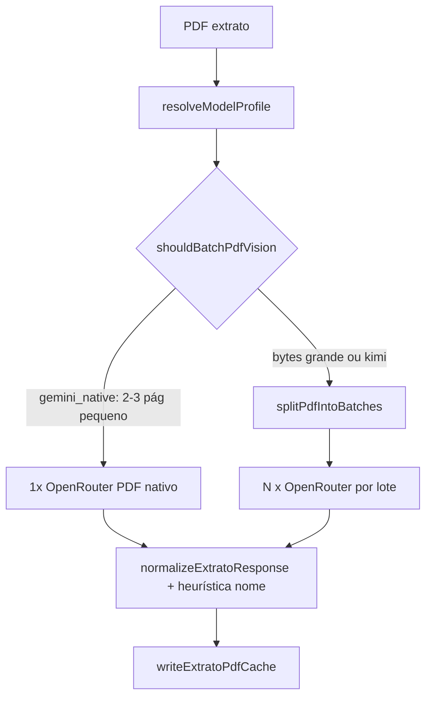

# Design: Gemini 3.5 Flash como modelo padrão (extrato + match)

**Data:** 2026-05-27  
**Status:** Aprovado para implementação  
**Escopo:** Opção B — `OPENROUTER_PDF_MODEL` + `OPENROUTER_MODEL` (extrato PDF e match de movimentação). Comprovante legado (`extractStructuredFromPdf`) permanece fora.

---

## 1. Contexto

O SPC UP usa OpenRouter para:

| Fluxo | Módulo | Env hoje | Default hoje |
|-------|--------|----------|--------------|
| Extrato PDF (visão/texto) | `packages/core/src/ai/openrouter.ts` | `OPENROUTER_PDF_MODEL` | `moonshotai/kimi-k2.6` |
| Match movimentação ↔ cadastro | `packages/core/src/match/ai.ts` | `OPENROUTER_MODEL` | `moonshotai/kimi-k2.6` |
| Comprovante PDF único (legado) | `openrouter.ts` `extractStructuredFromPdf` | `OPENROUTER_MODEL` | `anthropic/claude-sonnet-4` |

Kimi exige ramos especiais: `json_object`, prompt PT longo, plugin `mistral-ocr`, lotes conservadores por página. Gemini (`google/gemini-3.5-flash`) lê PDF nativo com `json_schema` strict e não usa mistral-ocr.

**Testes reais (2026-05-27, cache frio, documentos Bahia):**

| PDF | Páginas | API calls | Transações | `nome` preenchido | Tempo |
|-----|---------|-----------|------------|-------------------|-------|
| Extrato Jan PIX | 2 | 2 (lote por página) | 34 | 34 | ~45 s |
| EXTRATO TOTAL JANEIRO | 3 | 3 | 27 | 0 | ~52 s |

Problemas atuais para Gemini: `shouldBatchPdfVision` fatia qualquer PDF com `pageCount > 1`; prompts e fallback OCR foram desenhados para Kimi; match já usa `json_schema` (compatível com Gemini).

**Referências:** `docs/superpowers/specs/2026-05-26-documentos-teste-ingestao-descobertas.md`, `packages/core/src/ai/openrouter.ts`, `packages/core/src/ingest/pdf-split.ts`.

---

## 2. Objetivo

Padronizar **google/gemini-3.5-flash** como modelo default de extrato e match, com perfil de capacidades por modelo (não mais `if (isKimiModel)` espalhado). Kimi permanece disponível apenas via override explícito em env.

---

## 3. Critérios de sucesso (verificáveis)

| ID | Cenário | Critério |
|----|---------|----------|
| S1 | `Extrato Jan PIX (1).pdf` cold | ≥ 34 transações; ≥ 90% das linhas com `nome` ou CPF/CNPJ válido |
| S2 | `Extrato Jan PIX` cold | ≤ 1 chamada HTTP OpenRouter (PDF inteiro, sem lote por página) |
| S3 | `Extrato Jan PIX` cold | Latência ≤ 25 s (ambiente dev com `OPENROUTER_CACHE=0`) |
| S4 | `EXTRATO TOTAL JANEIRO (1) (1).pdf` cold | ≥ 25 transações; ≥ 50% das linhas com `nome` ou CPF/CNPJ |
| S5 | Match unitário | Testes existentes de `match/ai.ts` passam com modelo Gemini mockado |
| S6 | Kimi override | `OPENROUTER_PDF_MODEL=moonshotai/kimi-k2.6` aplica mistral-ocr + batching conservador |
| S7 | Cache | Chave de cache inclui slug do modelo; troca de default não reutiliza saída Kimi |

**Fora de escopo desta entrega:**

- Migrar `extractStructuredFromPdf` (comprovante único) para Gemini.
- Implementar LLM real em `consolidacao/ai.ts` (permanece heurística stub).
- Paralelizar lotes PDF; segunda passagem dedicada só para CPF.
- Trocar default global de comprovante para Gemini.

---

## 4. Abordagem escolhida

**Perfil de modelo centralizado** (`model-profile.ts`), não apenas troca de constantes.

Alternativas descartadas:

- **Só troca de default:** mantém acoplamento Kimi em `isKimiModel()` e dificulta evolução.
- **Feature flag `SPC_AI_PROFILE`:** dois caminhos em produção; adiado — rollback via env `OPENROUTER_*` é suficiente.

---

## 5. Arquitetura

### 5.1 Novo módulo `packages/core/src/ai/model-profile.ts`

```ts
export type ResponseFormatKind = "json_schema" | "json_object";
export type PdfBatchingStrategy = "gemini_native" | "kimi_conservative";

export interface ModelProfile {
  slug: string;
  responseFormat: ResponseFormatKind;
  pdfBatching: PdfBatchingStrategy;
  pdfPlugins: Array<{ id: string; pdf?: { engine: string } }> | null;
  ocrTextFallback: boolean; // usar extractTransactionsFromPdfText se OCR em annotations
  extratoPromptVariant: "gemini" | "kimi";
}
```

**Resolução:** `resolveModelProfile(model: string): ModelProfile`

| Slug (match parcial) | responseFormat | pdfBatching | pdfPlugins | ocrTextFallback | extratoPromptVariant |
|----------------------|----------------|-------------|------------|-----------------|----------------------|
| `/kimi/i` | json_object | kimi_conservative | mistral-ocr | true | kimi |
| `/gemini/i` (default genérico) | json_schema | gemini_native | null | false | gemini |
| Outros (fallback) | json_schema | gemini_native | null | false | gemini |

`isKimiModel(model)` pode delegar a `resolveModelProfile(model).pdfBatching === "kimi_conservative"` e ser marcado deprecated internamente.

### 5.2 Batching (`pdf-split.ts`)

**`gemini_native` (`shouldBatchPdfVision`):**

- Lote **sim** se `buffer.length >= OPENROUTER_PDF_SPLIT_MIN_BYTES` (default 200_000).
- Lote **sim** se `pageCount > MAX_EXTRATO_PAGES` (erro antes, em `assertExtratoPageLimit`).
- Lote **não** só por `pageCount > 1` quando bytes abaixo do limiar e páginas ≤ `MAX_EXTRATO_PAGES` (default 12).

**`kimi_conservative` (comportamento atual):**

- Lote se `pageCount > 1`, ou `buffer.length >= OPENROUTER_PDF_SPLIT_MIN_BYTES`, ou (Kimi e `buffer.length >= 80_000`).

### 5.3 Extrato (`openrouter.ts`)

| Aspecto | Gemini (default) | Kimi (override) |
|---------|------------------|-----------------|
| Default constant | `google/gemini-3.5-flash` | via env |
| System prompt | `GEMINI_EXTRATO_SYSTEM_PROMPT` (PT, schema no prompt + json_schema) | `KIMI_EXTRATO_SYSTEM_PROMPT` (inalterado) |
| response_format | `json_schema` strict | `json_object` |
| Plugins | nenhum | mistral-ocr |
| OCR fallback pós-arquivo | desligado | ligado se `transacoes.length === 0` e OCR text ≥ MIN_TEXT_CHARS |
| Pós-processo | ver §5.4 | igual |

`buildStructuredResponseFormat`, `withPdfParserPlugins`, `extratoSystemPrompt` passam a usar `resolveModelProfile(model)`.

### 5.4 Pós-processo de qualidade (extrato)

Em `normalizeExtratoItem` (ou função dedicada chamada no final de `normalizeExtratoResponse`):

- Se `nome` vazio e `descricao` não for código curto de banco (heurística: comprimento ≥ 8 e não corresponde a padrão `^[A-Z0-9\s]{3,12}$` tipo `CRED TEV`), copiar `descricao` → `nome`.
- Manter lógica existente `contraparte` → `nome`, `cpf_cnpj` → `cpf`/`cnpj`.

Objetivo: melhorar S4 (TOTAL JANEIRO) sem segunda chamada LLM.

### 5.5 Match (`match/ai.ts`)

- `DEFAULT_MODEL = "google/gemini-3.5-flash"`.
- Manter `json_schema` strict (`AI_MATCH_SCHEMA`).
- Opcional mínimo: extrair `buildStructuredResponseFormat` compartilhado com openrouter para Kimi override em match (se alguém setar `OPENROUTER_MODEL=kimi`).
- Atualizar comentários (“OpenRouter structured match”, não “Kimi”).
- **Não** adicionar retry/timeout em match nesta entrega, salvo se testes de integração existentes falharem.

### 5.6 Configuração

```bash
OPENROUTER_PDF_MODEL=google/gemini-3.5-flash
OPENROUTER_MODEL=google/gemini-3.5-flash
```

Rollback operacional:

```bash
OPENROUTER_PDF_MODEL=moonshotai/kimi-k2.6
OPENROUTER_MODEL=moonshotai/kimi-k2.6
```

Após deploy: comunicar que cache local (`.openrouter-cache`) pode ser invalidado com `OPENROUTER_CACHE=0` ou remoção do diretório para reprocessar extratos.

---

## 6. Fluxo de dados (extrato scan)



---

## 7. Testes

| Tipo | Arquivo / comando | O que cobre |
|------|-------------------|-------------|
| Unit | `model-profile.test.ts` | Matriz slug → perfil |
| Unit | `pdf-split.test.ts` (novo ou estendido) | `shouldBatchPdfVision` gemini vs kimi |
| Unit | `openrouter-extrato.test.ts` | Defaults Gemini; plugins só Kimi; pós-processo nome |
| Integration | `openrouter-extrato.integration.test.ts` | Default suite Gemini nos PDFs Bahia; suite Kimi se `SPC_TEST_KIMI=1` |
| Unit | testes match existentes | Mock com modelo `google/gemini-3.5-flash` |
| Smoke manual | `scripts/test-extrato-model.ts google/gemini-3.5-flash` | S1–S4 após implementação |

---

## 8. Arquivos impactados

| Arquivo | Mudança |
|---------|---------|
| `packages/core/src/ai/model-profile.ts` | **Criar** |
| `packages/core/src/ai/model-profile.test.ts` | **Criar** |
| `packages/core/src/ai/openrouter.ts` | Perfil; default; prompts; OCR condicional |
| `packages/core/src/ingest/pdf-split.ts` | Batching por perfil |
| `packages/core/src/match/ai.ts` | Default Gemini; comentários |
| `packages/core/src/ai/openrouter-extrato.test.ts` | Expectativas default |
| `packages/core/src/ai/openrouter-extrato.integration.test.ts` | Suite Gemini + Kimi opcional |
| `.env.example`, `apps/web/.env.example` | Defaults e comentários |
| `docs/superpowers/specs/2026-05-26-documentos-teste-ingestao-descobertas.md` | Atualizar métricas e env |
| `docs/piloto-checklist.md` | Modelo default |

---

## 9. Riscos e mitigação

| Risco | Mitigação |
|-------|-----------|
| TOTAL JANEIRO continua sem nomes | Heurística pós-processo + prompt Gemini PT; se S4 falhar, issue separada (prompt iterativo) |
| PDF muito grande em 1 chamada Gemini | Limiar `OPENROUTER_PDF_SPLIT_MIN_BYTES` mantém lotes |
| Regressão Kimi em produção | Override env + testes `SPC_TEST_KIMI=1` |
| Custo/latência OpenRouter | Menos chamadas por extrato 2–3 pág; monitorar painel |

---

## 10. Ordem de implementação (para o plano)

1. `model-profile` + testes  
2. `pdf-split` batching + testes  
3. `openrouter.ts` (defaults, perfil, prompts, OCR, pós-processo)  
4. `match/ai.ts` default  
5. Testes unitários e integração  
6. Docs e `.env.example`  
7. Smoke nos PDFs Bahia; registrar métricas S1–S4  

---

## 11. Auto-revisão da spec

- [x] Sem placeholders TBD em requisitos funcionais  
- [x] Escopo B consistente (extrato + match; comprovante fora)  
- [x] Critérios S1–S7 mensuráveis  
- [x] Batching gemini vs kimi sem contradição com §5.2  
- [x] Escopo único para um plano de implementação  
