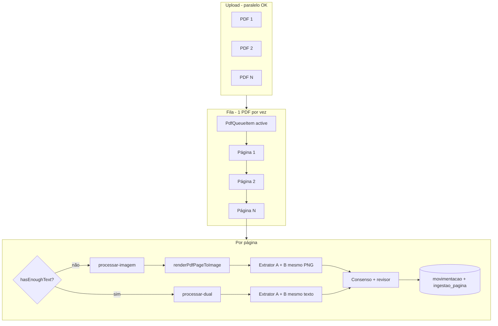

# Extração dual-model, páginas imagem e fila de PDFs — Design

**Data:** 2026-05-28  
**Produto:** SPC UP — Unidade Popular  
**Status:** Aprovado (2026-05-28)  
**Relacionado:** `2026-05-26-pdf-extrato-prestacao-design.md`, `2026-05-26-ingestao-erros-pdf-design.md`, `2026-05-26-prestacao-submit-progress-design.md`, `2026-05-27-consolidacao-proveniencia-pdf-design.md`

**Estende / corrige:** ingestão página a página já em produção; elimina falha falsa `PDF_SEM_TEXTO_E_VISAO_FALHOU` quando só a última página é não transacional; adiciona consenso entre dois modelos e fila explícita de PDFs.

---

## 1. Resumo

Processar extratos PDF com **dois modelos OpenRouter** (primário + secundário) na **mesma entrada** por página (texto compartilhado ou **mesmo PNG** em scan). Linhas em **consenso** (data + valor + direção) entram automaticamente; divergências passam por **revisor** com score 0–100 (limiar **80**). Páginas ambíguas ficam em **VERIFICAR** (preview de imagem + ignorar/retry), sem edição manual de linhas.

**Orquestração de desempenho:** upload pode enviar vários PDFs; **processamento é serial** — **um PDF por vez**, **uma página por vez**; fila ordenada no cliente com estado persistido o suficiente para retomar após refresh. Paralelismo permitido **apenas** entre os dois extratores (e batch do revisor) **na mesma página**.

---

## 2. Decisões de produto

| Tema | Decisão |
|------|---------|
| Modelos | Primário: extrato atual (ex. Gemini); secundário: `openai/gpt-4o-mini` ou slug OpenRouter confirmado (`gpt-mini-latest`); revisor: mesmo secundário por padrão |
| Página com texto | `processar-dual`: ambos leem o **mesmo** texto (ou PDF com texto suficiente) |
| Página imagem / scan | `processar-imagem`: render PNG **uma vez**; **ambos** modelos analisam o **mesmo** bitmap |
| Consenso | Interseção estrita: `data` + `valor` + `direção` (nome/doc fora da chave) |
| Divergência | Revisor atribui score; ≥ 80 persiste; &lt; 80 → `ingestao_linha_pendente` |
| Página sem transações | Heurística automática (d): keywords ou texto &lt; 50 chars → `NAO_TRANSACIONAL`; senão → `VERIFICAR` |
| Revisão operador | Só ver: preview + amostra de texto + lista incertas; **Ignorar página** ou **Tentar novamente** (`force`) |
| Edição manual de linhas | Fora do escopo |
| Vários PDFs na sessão | Upload em lote; **fila serial** — um PDF completo antes do próximo |
| Várias páginas | **Serial** — nunca duas páginas do mesmo PDF em funções paralelas (v1) |
| Conclusão do arquivo | `CONCLUIDO` se ≥1 página `OK` ou `NAO_TRANSACIONAL`; `VERIFICAR` não bloqueia conclusão; `ERRO` só se falha técnica em todas ou zero movs e zero páginas não transacionais |
| Threshold score | `INGEST_SCORE_THRESHOLD=80` (env) |

---

## 3. Fila de PDFs (um documento por vez)

### 3.1 Princípio

| Fase | Paralelismo |
|------|-------------|
| Upload para Blob | Vários arquivos na mesma sessão (XHR, como hoje) |
| Armazenar `arquivo_ingestao` | Pode registrar todos os PDFs após upload |
| **Processar extrato** | **1 PDF ativo** na fila |
| Dentro do PDF | **1 página** por requisição |
| Dentro da página | **2 extratores** em `Promise.all` + revisor (batch opcional) |

Motivação: limite `maxDuration=300` por página na Vercel; rate limit OpenRouter; status coerente de `arquivo_ingestao` / `ingestao_pagina`; progresso legível para o operador.

### 3.2 Estrutura da fila (cliente)

Estado em `use-prestacao-submit` (ou hook dedicado `use-pdf-ingest-queue`):

```typescript
type PdfQueueItem = {
  arquivoId: string;
  nome: string;
  totalPaginas: number;
  paginaAtual: number; // próxima a processar (1-based)
  status: "pending" | "active" | "done" | "error" | "verificar";
  paginasVerificar: number[];
  movimentacoesTotal: number;
};

type PdfIngestQueue = {
  sessaoId: string;
  items: PdfQueueItem[]; // ordem = ordem de seleção no wizard
  activeIndex: number | null;
};
```

**Algoritmo:**

1. Após upload, montar `items[]` só com PDFs (`modo: armazenar`, `paginas`, `arquivo_id`).
2. `activeIndex = 0`.
3. Enquanto houver item ativo:
   - Para `pagina = item.paginaAtual .. item.totalPaginas`:
     - `POST /processar` (orquestrador) ou rota específica.
     - Atualizar progresso global: `(pdfIndex * pages + pagina) / totalWork`.
     - Se `statusPagina === VERIFICAR`, acrescentar em `paginasVerificar`; **continuar** próxima página (não parar a fila).
     - Se `ERRO` técnico na página: marcar item `error`; **parar fila** ou pular para próximo PDF (produto: **parar fila** e exibir erro; operador pode “continuar com próximo” em v2).
   - Ao terminar todas as páginas: `item.status = verificar` se `paginasVerificar.length > 0`, senão `done`; `activeIndex++`.
4. Quando fila vazia: redirect kanban/consolidação com aviso se houver `verificar`.

### 3.3 API de fila (opcional v1.1)

v1: fila **só no cliente** (menor escopo).

v1.1 (se refresh perder estado): persistir em `sessao_prestacao.meta` (jsonb) ou tabela `ingestao_fila`:

| Coluna | Descrição |
|--------|-----------|
| `sessaoPrestacaoId` | FK |
| `arquivoIngestaoId` | FK |
| `ordem` | int |
| `paginaProxima` | int default 1 |
| `status` | pending \| active \| done \| error \| verificar |

Endpoint `GET /api/prestacao/sessoes/[id]/fila` para retomar wizard.

**Decisão v1:** fila no cliente; documentar extensão v1.1.

### 3.4 Progresso na UI

Texto composto:

- Nível fila: `Arquivo 2 de 5 — extrato-marco.pdf`
- Nível página: `Página 3 de 12`
- Badges por página do PDF ativo: ✓ OK · ○ não transacional · ⚠ verificar · ✗ erro

Barra global: `paginasProcessadas / soma(paginas de todos os PDFs na fila)`.

---

## 4. Arquitetura

### 4.1 Diagrama



### 4.2 Orquestrador `POST .../paginas/[pagina]/processar`

Mantém URL atual do wizard; implementação passa a:

1. Carregar página (`extractSinglePageBuffer`).
2. `extractPdfText` → `hasEnoughText`.
3. Delegar:
   - `hasEnoughText` → `processarPaginaDual(...)` (core).
   - senão → `processarPaginaImagem(...)` (core).
4. Retornar payload unificado (`modo: "texto" | "imagem"`, `statusPagina`, etc.).

Rotas explícitas adicionais (mesma lógica core, para retry e testes):

| Método | Rota |
|--------|------|
| `POST` | `.../paginas/[pagina]/processar-dual` |
| `POST` | `.../paginas/[pagina]/processar-imagem` |
| `GET` | `.../paginas/[pagina]/imagem` |
| `POST` | `.../paginas/[pagina]/ignorar` |

`ultimoModo` em `ingestao_pagina` define qual rota usar em **Tentar novamente**.

---

## 5. Dual-model e imagem

### 5.1 Normalização e consenso

Chave: `hash(YYYY-MM-DD, valor_centavos, ENTRADA|SAIDA)`.

- `CONSENSO` → `confiancaGlobal = 100`, `origemExtracao.consenso = true`.
- `SÓ_A` / `SÓ_B` → chamada revisor (score 0–100).

### 5.2 `processar-imagem` (obrigatório para scan)

1. `pngBuffer = renderPdfPageToImage(buffer, pagina, { scale: 2 })`.
2. `Promise.all([ extractFromImage(png, PRIMARY), extractFromImage(png, SECONDARY) ])`.
3. Mesmo pipeline de consenso + revisor que texto.
4. Cache OpenRouter indexado por hash do PNG + modelo.

`extractFromImage`: payload OpenRouter com `image_url` (base64 PNG); mesmo schema JSON de transações do extrato.

### 5.3 Heurística não transacional

```text
NAO_TRANSACIONAL se:
  text.length < INGEST_NON_TRANSACTIONAL_MIN_CHARS (50), ou
  texto contém (saldo|total|resumo|extrato emitido|período|agência|conta corrente|tarifa)
  E nenhum modelo retornou transações
```

Não lançar erro fatal; upsert `ingestao_pagina.status = NAO_TRANSACIONAL`.

### 5.4 Falha parcial de modelo

| Cenário | Comportamento |
|---------|----------------|
| Primário OK, secundário falha | Processar só primário → revisor em todas as linhas |
| Ambos falham | `ingestao_pagina.status = ERRO`, 422 |
| Ambos 0 linhas, texto “transacional” | `VERIFICAR` |

### 5.5 Retry (`force: true`)

- Invalidar cache texto + PDF/PNG da página.
- Reexecutar extratores; opcional: mesmos dois modelos (não trocar extrator no retry v1).

---

## 6. Modelo de dados

### 6.1 `ingestao_pagina` (nova)

| Coluna | Tipo | Notas |
|--------|------|-------|
| `id` | uuid | PK |
| `arquivoIngestaoId` | uuid | FK, unique com `pagina` |
| `pagina` | int | 1-based |
| `status` | varchar | `OK` \| `NAO_TRANSACIONAL` \| `VERIFICAR` \| `ERRO` |
| `modo` | varchar | `texto` \| `imagem` |
| `aceitas` | int | |
| `incertas` | int | |
| `motivo` | text? | |
| `textoAmostra` | text? | ≤ 500 chars |
| `processadoEm` | timestamptz | |

### 6.2 `ingestao_linha_pendente` (nova)

Staging de linhas com score &lt; 80; removidas ao ignorar página ou reprocessar.

### 6.3 `movimentacao` (existente)

Preencher `confiancaGlobal` (0–100) e `origemExtracao`:

```json
{
  "pagina": 3,
  "modo": "dual",
  "consenso": true,
  "score": 92,
  "modelo_primario": "...",
  "modelo_secundario": "openai/gpt-4o-mini",
  "modelo_origem_linha": "consenso"
}
```

### 6.4 Status do arquivo

Substituir regra “0 movimentações na última página → ERRO”:

- `CONCLUIDO` quando existe pelo menos uma `ingestao_pagina` com `OK` (aceitas &gt; 0) ou `NAO_TRANSACIONAL`.
- `PDF_SEM_TEXTO_E_VISAO_FALHOU` apenas quando **todas** as páginas falharam tecnicamente ou nenhuma linha aceita e nenhuma página classificada como não transacional.

---

## 7. Wizard / UX

### 7.1 Painel “Verificar página N”

- Imagem: `GET .../paginas/N/imagem` (PNG server-side = o que os modelos viram).
- Lista de incertas (score, motivo, preview data/valor/direção).
- Botões: **Ignorar esta página** (`POST .../ignorar`); **Tentar novamente** (`force: true` na rota do `ultimoModo`).

### 7.2 Pós-submit

Banner se fila terminou com algum `verificar`: revisar antes de confiar nos totais. Redirect para kanban/consolidação mantém regra B de `ingestao-erros-pdf` (parcial OK).

### 7.3 Hook

`use-prestacao-submit` passa a:

1. Upload todos os PDFs.
2. Inicializar `PdfIngestQueue`.
3. `processQueue()` serial — **não** disparar segundo PDF até o primeiro concluir todas as páginas.
4. Expor `ingestProgress` com campos de fila + página.

---

## 8. Variáveis de ambiente

| Variável | Default | Uso |
|----------|---------|-----|
| `OPENROUTER_MODEL_PRIMARY` | modelo extrato atual | Extrator 1 |
| `OPENROUTER_MODEL_SECONDARY` | `openai/gpt-4o-mini` | Extrator 2 |
| `OPENROUTER_MODEL_REVIEWER` | = secundário | Score |
| `INGEST_SCORE_THRESHOLD` | `80` | Auto-aceite |
| `INGEST_NON_TRANSACTIONAL_MIN_CHARS` | `50` | Heurística |
| `OPENROUTER_API_KEY` | — | Obrigatório |

---

## 9. Componentes (implementação)

| Camada | Arquivo / módulo | Responsabilidade |
|--------|------------------|------------------|
| Core | `ingest/pdf-render.ts` | `renderPdfPageToImage` |
| Core | `ai/openrouter-image.ts` | `extractFromImage` |
| Core | `ingest/dual-extract.ts` | Consenso, revisor, heurística |
| Core | `ingest/pdf-pagina-dual.ts` | `processarPaginaDual`, `processarPaginaImagem` |
| Core | `ingest/pdf-queue.ts` | Tipos + helper de progresso (opcional) |
| Web | `hooks/use-pdf-ingest-queue.ts` | Fila serial |
| Web | `hooks/use-prestacao-submit.ts` | Integrar fila |
| Web | `components/prestacao/pagina-verificar-panel.tsx` | UI verificar |
| Web | `api/.../processar/route.ts` | Orquestrador |
| Web | `api/.../processar-dual/route.ts` | |
| Web | `api/.../processar-imagem/route.ts` | |
| Web | `api/.../imagem/route.ts` | GET PNG |
| Web | `api/.../ignorar/route.ts` | |
| DB | migration | `ingestao_pagina`, `ingestao_linha_pendente` |

---

## 10. Testes e rollout

### 10.1 Testes unitários

- Consenso: interseção, só A, só B.
- Heurística: rodapé → `NAO_TRANSACIONAL`; tabela sem match → `VERIFICAR`.
- Score: ≥ 80 persiste; &lt; 80 pendente.
- Fila: ordem preservada; não inicia PDF2 antes de PDF1 terminar (teste do hook).

### 10.2 Integração

- PDF texto 3 páginas: dual em cada página; CONCLUIDO.
- PDF scan (página 3 só imagem): `processar-imagem`, dois modelos no mesmo PNG.
- Caso regressão: “EXTRATO TOTAL JANEIRO” com pg 3 não transacional → não `PDF_SEM_TEXTO_E_VISAO_FALHOU` no arquivo inteiro.

### 10.3 Rollout

1. Migration + core (`dual-extract`, render imagem).
2. Rotas API + orquestrador.
3. Fila no cliente + painel verificar.
4. Deploy Vercel; validar env secundário/revisor.
5. Monitorar logs `ingestLog` por `modo`, `statusPagina`, duração.

---

## 11. Fora do escopo (v1)

- Processar vários PDFs ou páginas em paralelo no servidor.
- Fila persistida no DB (v1.1).
- Edição manual de transações no wizard.
- Escolha de modelo pelo operador.
- Workflow / Queue Vercel para ingest assíncrona.

---


## 12. Implementação

Checklist do que foi entregue vs pendente (baseline 2026-05-28). **Fila serial** e **um PDF por vez** permanecem nas §§1–3 (processamento serial no cliente; paralelismo só entre os dois extratores na mesma página).

| Item | Estado | Notas |
|------|--------|-------|
| `ingest/dual-extract.ts` — consenso, revisor, heurística, `dualExtractPage` | Feito | `dual-extract.test.ts` |
| `ingest/pdf-render.ts` — `renderPdfPageToImage` | Feito | |
| `ingest/pdf-pagina.ts` — orquestra dual + persistência `ingestao_pagina` / pendentes | Feito | Regra `CONCLUIDO` vs não transacional |
| Visão OpenRouter (`extractFromImage` / PNG) | Feito | Em `ai/openrouter.ts` (sem módulo `openrouter-image.ts` separado) |
| Migration `ingestao_pagina`, `ingestao_linha_pendente` | Feito | `0006_ingestao_pagina_fila.sql` |
| API `processar`, `processar-dual`, `processar-imagem`, `GET imagem`, `ignorar` | Feito | |
| Fila serial no wizard | Feito | Loop `pdfJobs` em `use-prestacao-submit.ts`; progresso `Arquivo N de M` |
| Hook dedicado `use-pdf-ingest-queue.ts` | Pendente | Lógica inline no submit (aceitável v1) |
| `ingest/pdf-queue.ts` (tipos/progresso) | Pendente | Opcional na spec |
| `pagina-verificar-panel.tsx` | Pendente | Estado `paginasVerificar` no hook; UI dedicada incompleta |
| Fila persistida (v1.1) | Pendente | Conforme §3.3 |
| Testes integração PDF scan / regressão JANEIRO | Pendente | |
| Teste hook: não iniciar PDF2 antes de PDF1 | Pendente | |
| Badges por página na UI (✓ ○ ⚠ ✗) | Parcial | Verificar cobertura no wizard |

---

## 13. Critérios de aceite

1. Com 3 PDFs na sessão, processamento ocorre **estritamente em série** (métrica: no máximo um `arquivoId` com páginas em voo).
2. Página scan: **dois** modelos recebem o **mesmo** PNG; consenso aplicado.
3. Página de saldo/rodapé: `NAO_TRANSACIONAL`, arquivo pode `CONCLUIDO` com movs de outras páginas.
4. Linha só em um modelo com score &lt; 80: aparece em verificar; ignorar remove pendências e libera página.
5. `GET .../imagem` retorna PNG da página para o painel sem carregar PDF inteiro no browser.

---

## Changelog do design

| Data | Alteração |
|------|-----------|
| 2026-05-28 | Spec inicial: dual-model, rotas imagem, fila 1 PDF por vez, heurística (d), score 80 |
| 2026-05-28 | Status aprovado; §12 Implementação (checklist built vs pending) |
