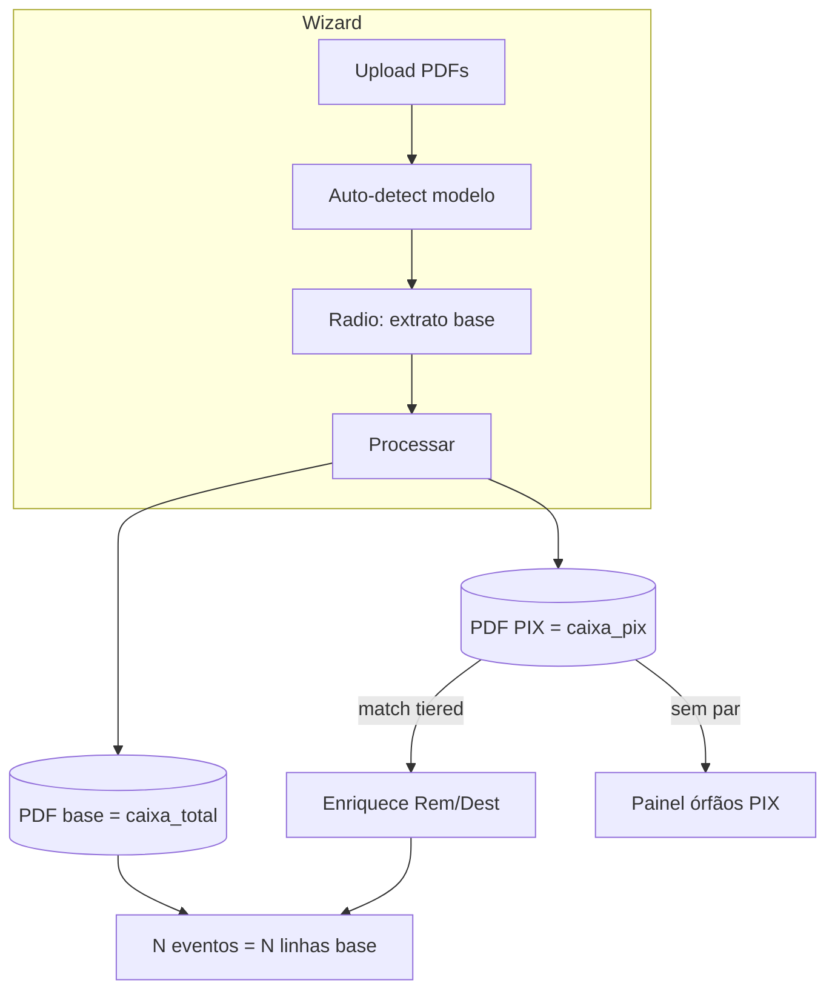

# Extrato base na consolidação — Design

**Data:** 2026-06-11  
**Cliente:** Unidade Popular (UP) — SPC UP  
**Status:** Aprovado (grill-me 2026-06-11)  
**Relacionado:**
- [2026-05-26-consolidacao-extratos-design.md](./2026-05-26-consolidacao-extratos-design.md)
- [2026-06-08-extrato-multi-layout-campos-extracao-design.md](./2026-06-08-extrato-multi-layout-campos-extracao-design.md)
- [2026-06-08-remetente-destinatario-design.md](./2026-06-08-remetente-destinatario-design.md)
- [2026-06-08-anti-falsos-positivos-match-design.md](./2026-06-08-anti-falsos-positivos-match-design.md)

**Plano:** [../plans/2026-06-11-extrato-base-consolidacao.md](../plans/2026-06-11-extrato-base-consolidacao.md)

---

## 1. Resumo

Na prestação de contas, o **extrato Total** (oficial) é a **fonte da verdade** para linhas financeiras. O **extrato PIX** complementa com **nome** (`remetente_destinatario`) e match cadastro.

O operador **confirma qual PDF é o base** por sessão. A planilha consolidada tem **1 linha por movimentação do PDF base**. PIX sem par no base vai para **painel de avisos**, não para a planilha principal.

---

## 2. Problema (estado jun/2026)

| Sintoma | Causa |
|---------|--------|
| Planilha com ~70 linhas (34 PIX + 36 Total) | Grão = união de PDFs, não base |
| `dataMovimento` do evento pode ser do PIX | `buildConsolidacaoCandidates` usa `pair.a.dataMovimento` (primeiro cronológico) |
| Papel PIX/Total só por **nome do arquivo** | `classifyArquivoPapel(nomeArquivo)` ignora `extratoModeloId` |
| Consolidação não roda com 1 PDF | `pdfCount < 2` em `consolidateSession` |
| Sem conceito explícito de “extrato base” | Nenhum FK na sessão |

---

## 3. Premissa de produto

> Para prestação de contas, a **data do extrato Total** é a base contábil (linha com **número de documento** da transação). O PIX existe para obter o **nome** da contraparte quando o Total só traz histórico genérico.

---

## 4. Decisões (grill-me 2026-06-11)

| # | Tema | Decisão |
|---|------|---------|
| 1 | Designar base | **C** — auto-sugere `caixa_total` (`detectExtratoModeloFromFilename`); operador confirma no wizard |
| 2 | Grão da planilha | **A** — 1 linha = 1 movimentação do PDF base |
| 3 | Match base ↔ PIX | **C** — tier 1: `documento`(DDHHMM) ↔ `data`+`hora` ±5 min + `valor`+`direção`; tier 2: fallback data±3d + nome |
| 4 | Linhas só-PIX | **B** — painel “PIX sem par no total”; fora da planilha principal |
| 5 | 2+ PDFs Total | **A** — exatamente 1 base (radio); Processar bloqueado até escolher |
| 6 | Base sem par PIX | **B** — coluna Rem/Dest vazia; `contraparteDoHistorico()` só para **score** cadastro |
| 7 | Campos no par | **A** — financeiro do base; `remetente_destinatario` do PIX |
| 8 | Só base (sem PIX) | **A** — consolidação roda (enriquecimento + cadastro) |
| 9 | Persistência | **A** — `sessao_prestacao.arquivo_base_ingestao_id` (FK) |
| 10 | PDF `outro` | **A** — ignorado no cruzamento v1 |
| 11 | Troca base pós-processo | **B** — persiste FK; recálculo explícito pelo operador |
| 12 | Recalcular | **C** — modal: default apaga **todos** eventos e recria; checkbox “manter aprovados” |

### 4.1 Relação com specs anteriores

- **Remetente/Destinatário:** ingestão continua proibindo derivar `remetente_destinatario` de histórico. Na planilha consolidada, Rem/Dest vem **só do PIX pareado** ou edição manual — nunca de cópia automática do histórico.
- **Multi-layout (2026-06-08):** colunas união dos modelos e `campos_extracao` **mantidos**. O que muda é o **grão da consolidação** (base-driven, não união).
- **`consolidarExtratos`:** coluna legada; consolidação já roda com ≥2 PDFs independente da flag. Com esta spec, gatilho passa a ser **“tem base confirmado”** (com ou sem PIX).

---

## 5. Modelo mental



---

## 6. Designação do extrato base

### 6.1 Auto-detect (existente)

Reutilizar `detectExtratoModeloFromFilename` e dropdown de modelo (`extratoModeloId` em `arquivo_ingestao.metadados`).

### 6.2 Confirmação no wizard

| Situação | UI | Bloqueio Processar |
|----------|-----|-------------------|
| 0 arquivos `caixa_total` | Aviso: sem extrato base | Opcional: ingest avulsa sem consolidação |
| 1 `caixa_total` | Auto-selecionado como base (badge “Extrato base”) | Não |
| 2+ `caixa_total` | **Radio** obrigatório entre candidatos | Sim, até escolher 1 |
| Base escolhido + PIX | Normal | Não |

Ao **Processar**, API persiste `arquivo_base_ingestao_id` na sessão.

### 6.3 Troca de base após processar

- `PATCH` sessão ou endpoint dedicado atualiza `arquivo_base_ingestao_id`.
- **Não** recalcula automaticamente.
- Botão **Recalcular consolidação** na tela de consolidação/planilha.

### 6.4 Modal Recalcular (decisão 12)

- Texto: troca de base ou reprocessamento invalida pares atuais.
- **Default:** `deleteAllConsolidacaoEvents(sessaoId)` + `consolidateSession`.
- **Checkbox** “Manter eventos já aprovados”: se marcado, equivalente ao comportamento atual (`deletePendingConsolidacaoEvents` apenas) — operador assume risco.

---

## 7. Grão e merge de campos

### 7.1 Evento consolidado

- **Sempre** 1 evento por movimentação do arquivo base (ordenadas por `dataMovimento`, depois ordem de ingestão).
- Par PIX opcional: evento tem 2 linhas (`papel` BASE/COMPLETO + PIX); sem par: 1 linha.

### 7.2 Tabela de autoridade

| Campo planilha / evento | Fonte |
|-------------------------|--------|
| `dataMovimento` | **Base** |
| `valor`, `direcao` | **Base** |
| `documento`, `historico`, `saldo` | **Base** (`campos_extracao`) |
| `descricao` / `descricaoRaw` | **Base** (`descricao_raw`) |
| `remetente_destinatario` | **PIX** se par; senão `null` |
| `nrExtratoBancario` | `documento` do base |
| Match cadastro (nome) | PIX se par; senão parse histórico **só score** |
| Match cadastro (doc) | CPF/CNPJ extraído do base |

### 7.3 Papel das linhas

Renomear semanticamente (enum pode manter valores DB):

| Papel | Significado |
|-------|-------------|
| `COMPLETO` / `BASE` | Linha do PDF base |
| `PIX` | Linha complementar |
| `OUTRO` | Não usado na consolidação v1 |

Papel derivado de `extratoModeloId` + comparação com `arquivo_base_ingestao_id`, **não** só regex no filename.

---

## 8. Algoritmo de match PIX → linha base

### 8.1 Pool

- **Bases:** `movimentacao` onde `arquivo_ingestao_id = sessao.arquivo_base_ingestao_id`.
- **PIX:** `movimentacao` onde `metadados.extratoModeloId = caixa_pix` (ou papel PIX) e `arquivo_ingestao_id ≠ base`.
- **Ignorar:** `outro`, segundo Total não-base, PDFs sem modelo válido.

### 8.2 Tier 1 — documento ↔ hora

Reutilizar `pixTotalDocumentoHoraMatch` (`candidates.ts`):

- `documento` do base = 6 dígitos `DDHHMM`.
- `hora` do PIX ±5 min no mesmo dia do base.
- Obrigatório: `valor` e `direcao` iguais.

### 8.3 Tier 2 — fallback

Se tier 1 falhar:

- `valor` + `direcao` iguais.
- Janela de data: base entre PIX e PIX+3 dias (`isDateWindowMatch` atual).
- Nome: `remetente_destinatario` (PIX) vs `contraparteDoHistorico(historico)` ou remetente vazio no base.
- `confianca ≤ 0.55` ou nomes divergentes → hipótese fraca / revisão humana, não auto-merge alto.

### 8.4 Atribuição 1:1

- Greedy por confiança decrescente, desempate cronológico (FIFO).
- Cada PIX usado no máximo uma vez.
- Cada linha base recebe no máximo um PIX.

### 8.5 Órfãos PIX

Movimentações PIX sem par após atribuição:

- Persistir em estrutura consultável (ver §9.3) ou derivar em query.
- Exibir painel com: data, valor, direção, nome, `nomeArquivo`.
- Badge sessão: `N PIX sem par no total`.

---

## 9. Modelo de dados

### 9.1 Migration

```sql
ALTER TABLE sessao_prestacao
  ADD COLUMN arquivo_base_ingestao_id uuid
  REFERENCES arquivo_ingestao(id);
```

Índice opcional: `ix_sessao_prestacao_arquivo_base`.

Invariante aplicação: `arquivo_base_ingestao_id` deve referenciar arquivo da mesma sessão com `extratoModeloId = caixa_total`.

### 9.2 API / tipos

- `ProcessSessaoPdfOptions.arquivoBaseIngestaoId?: string`
- `getSessao` retorna `arquivoBaseIngestaoId`
- `PATCH /api/prestacao/sessoes/[id]` aceita `arquivoBaseIngestaoId`

### 9.3 Órfãos PIX (v1)

**Opção implementação:** tabela `consolidacao_pix_orfao` ou JSON em resposta de `GET consolidacao` sem persistir — plano prefere **query derivada** em v1 (menos schema); painel chama endpoint que compara pool PIX vs pares.

Se volume/auditoria exigir histórico: migration futura.

---

## 10. `consolidateSession` — novos gatilhos

| Condição atual | Nova condição |
|----------------|---------------|
| `pdfCount < 2` → skip | `!arquivo_base_ingestao_id` → skip `NO_BASE` |
| — | `baseMovCount === 0` → skip `NO_BASE_MOVIMENTACOES` |
| União de todos movs | Iterar só movs do base; PIX só no matching |

Consolidação com **só base** (sem PIX na sessão): gera eventos single-line com score cadastro (CPF/CNPJ + parse histórico).

---

## 11. UI

### 11.1 Wizard (`wizard.tsx` / `extrato-column-map-panel`)

- Radio “Extrato base desta prestação” entre arquivos `caixa_total`.
- Badge no arquivo base selecionado.
- Enviar `arquivoBaseIngestaoId` no `POST .../processar`.

### 11.2 Consolidação / planilha

- Painel colapsável **PIX sem par no total**.
- Botão **Recalcular consolidação** + modal (decisão 12).
- Contagem de linhas ≈ linhas do base (helper text).

### 11.3 Sessão com base já processada

- Dropdown para trocar base (se 2+ Total) → salva FK → CTA “Recalcular”.

---

## 12. Testes

### 12.1 Fixtures Bahia (jan/2025)

- `Extrato Jan PIX (1).pdf` + `EXTRATO TOTAL JANEIRO (1) (1).pdf`
- Esperado: **36** eventos (não 70), `dataMovimento` sempre do Total.
- Maioria com 2 origens (base + PIX); Rem/Dest preenchido via PIX.
- Órfãos PIX: `34 - pares` (tipicamente 0–2 dependendo extração).

### 12.2 Casos unitários (`candidates.test.ts`)

- Base-only session → N singles.
- Tier 1 documento↔hora forma par alto.
- Tier 2 fallback com nome divergente → confiança baixa.
- 2 PIX mesmo valor → FIFO cronológico.
- PIX órfão não gera evento próprio.

### 12.3 Regressão

- `pnpm --filter @spc-up/core test`
- `pnpm exec tsx scripts/test-remetente-match-e2e.ts` (opcional NotebookLM)

---

## 13. Fora de escopo v1

- PDF `outro` como complementar configurável (decisão 10-A).
- Múltiplos bases na mesma planilha (decisão 5-A proíbe).
- Preencher Rem/Dest a partir do histórico na coluna (decisão 6-B).
- Filtro/validação por `mesReferencia`.

---

## 14. Critérios de aceite

1. Operador confirma 1 PDF base; FK persistida.
2. Planilha consolidada tem 1 linha por movimentação do base.
3. `dataMovimento`, `valor`, `direcao`, `documento` do evento = base quando há par.
4. `remetente_destinatario` na planilha = PIX quando há par; vazio sem par.
5. PIX sem par listado no painel; não cria linha principal.
6. Sessão só-base consolida sem segundo PDF.
7. Recalcular com modal; default recria tudo; checkbox preserva aprovados.
